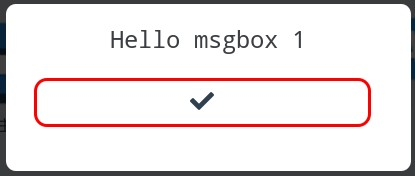
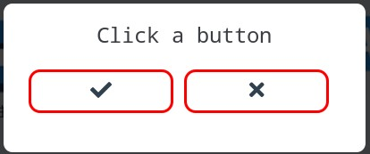
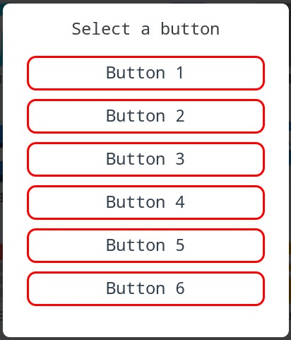

# msgbox示例

## msgbox_callback

原型：

```C
bool msgbox_callback(uint16_t id,const char*btn,void*user_data);
```

返回`false`将关闭对话框。

`id`: 点击的按钮序号

`btn`: 点击的按钮上的文字

`user_data`: 用户通过`msgbox_set_user_data`设置的指针，用于传参

## 一个提示框

```C
#include"gui/msgbox.h"

void example_msgbox_1(void){
	msgbox_alert("Hello msgbox %d",1);
}
```



## 一个是或否对话框

```C
#include"logger.h"
#include"gui/msgbox.h"
#define TAG "msgbox"

bool example_msgbox_2_cb(uint16_t id,const char*btn,void*user_data){
	if(id==0){
		tlog_debug("You clicked Yes");
	}else{
		tlog_debug("You clicked No");
	}
	return false;
}

void example_msgbox_2(void){
	msgbox_create_yesno(example_msgbox_2_cb,"Click a button");
}
```



## 一个自定义按钮对话框

```C
#include"logger.h"
#include"gui/msgbox.h"
#define TAG "msgbox"

bool example_msgbox_3_cb(uint16_t id,const char*btn,void*user_data){
	tlog_debug("You clicked %d (%s)",id,btn);
	return false;
}

void example_msgbox_3(void){
	static const char*btns[]={
		"Button 1",
		"Button 2",
		"Button 3",
		"Button 4",
		"Button 5",
		"Button 6",
		"",
	};
	msgbox_create_custom(example_msgbox_3_cb,btns,"Select a button");
}
```



当按钮数量超过5个时会变成竖排显示

注意：按钮数组必须以一个空字符串结束
